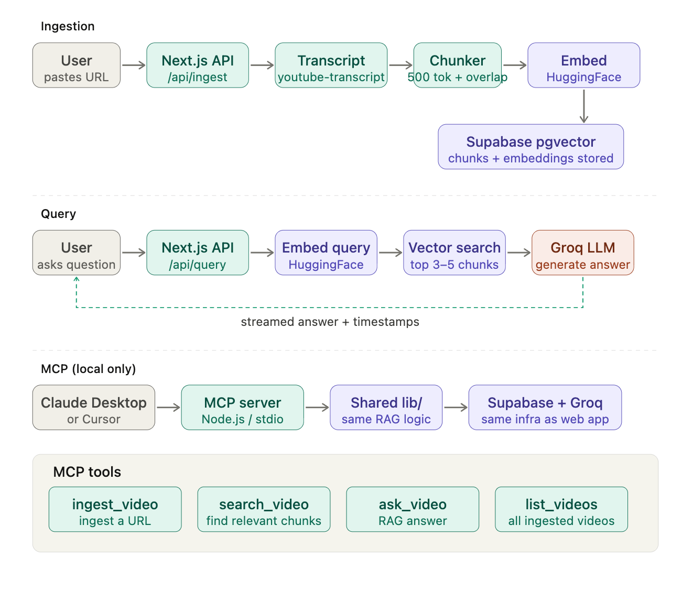

# Rewind
### Architecture Document
**Version:** 1.0  
**Author:** Qian Ni  
**Last updated:** March 2026

---

## Overview

Rewind is a Next.js web app with a Supabase vector database, Groq for LLM inference, and HuggingFace for embeddings. A separate MCP server exposes the same functionality to AI assistants like Claude Desktop.

There are three flows:

- **Ingestion** — user pastes a URL, transcript is fetched, chunked, embedded, and stored in Supabase
- **Query** — user asks a question, it gets embedded, Supabase finds the most relevant chunks, Groq generates a streamed answer with timestamps
- **MCP** — same as query, but triggered from Claude Desktop instead of the browser

Supabase and Groq are shared across all three flows. The web app and MCP server are just two interfaces into the same RAG pipeline.



---

## Tech stack

| Layer | Technology |
|---|---|
| Framework | Next.js 15, TypeScript, Tailwind CSS, shadcn/ui |
| LLM | Groq — Llama 3.3 70B |
| Embeddings | HuggingFace — nomic-embed-text |
| Transcription | youtube-transcript (Whisper fallback planned for v2) |
| Vector DB | Supabase pgvector |
| Streaming | Vercel AI SDK |
| MCP | @modelcontextprotocol/sdk |
| Deployment | Vercel (web app), local process (MCP server) |

---

## Data model

**videos**
| Column | Type |
|---|---|
| id | uuid PK |
| youtube_id | text |
| title | text |
| thumbnail | text |
| duration | int (seconds) |
| channel | text |
| created_at | timestamp |

**chunks**
| Column | Type |
|---|---|
| id | uuid PK |
| video_id | uuid FK |
| content | text |
| embedding | vector(768) |
| start_time | int (seconds) |
| end_time | int (seconds) |
| chunk_index | int |

---

## API routes

| Route | Method | What it does |
|---|---|---|
| `/api/ingest` | POST | Accepts URL, runs ingestion pipeline |
| `/api/query` | POST | Accepts question + optional video_id, streams answer (searches all videos if no video_id) |
| `/api/videos` | GET | Lists all ingested videos |
| `/api/videos/[id]` | DELETE | Removes video and its chunks |

---

## MCP tools

| Tool | What it does |
|---|---|
| `ingest_video` | Ingest a YouTube URL |
| `search_video` | Find relevant chunks for a query |
| `ask_video` | Ask a question, get a RAG answer |
| `list_videos` | List all ingested videos |

---

## Key decisions

**Chunking with overlap** — transcript split into ~500 token chunks with 50 token overlap, respecting sentence boundaries. Overlap ensures answers that span a chunk boundary aren't missed.

**Embedding model is fixed** — the same model must be used at ingestion and query time. Switching models later invalidates all stored vectors and requires full re-ingestion.

**MCP server is local only** — MCP clients communicate over stdio, which doesn't work on Vercel. The MCP server runs locally and shares the same `lib/` modules as the web app. The README includes setup instructions and a demo video.

**Shared environment variables** — both the Next.js app and MCP server read from a single `.env` file:
```
GROQ_API_KEY=
HUGGINGFACE_API_KEY=
SUPABASE_URL=
SUPABASE_ANON_KEY=
```

---

## Project structure

```
rewind-ai/
├── app/
│   ├── page.tsx
│   └── api/
│       ├── ingest/route.ts
│       ├── query/route.ts
│       └── videos/route.ts
├── components/
│   ├── IngestPanel.tsx
│   ├── VideoLibrary.tsx
│   ├── ChatPanel.tsx
│   └── SourceChips.tsx
├── lib/
│   ├── getTranscript.ts
│   ├── chunkTranscript.ts
│   ├── embed.ts
│   ├── search.ts
│   ├── buildPrompt.ts
│   ├── generate.ts
│   ├── ingest.ts
│   └── supabase.ts
├── mcp/
│   ├── server.ts
│   └── tools/
│       ├── ingestVideo.ts
│       ├── searchVideo.ts
│       ├── askVideo.ts
│       └── listVideos.ts
└── supabase/
    └── schema.sql
```
